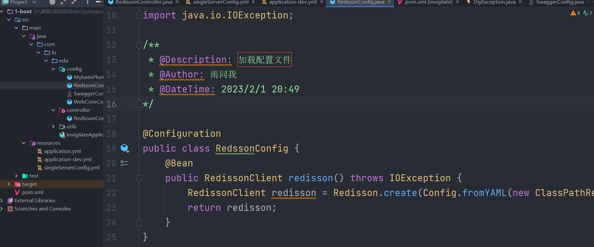

## 注意点

```apl
不知道为什么使用 swagger,里面添加 redisson 就会报错
```


## 快速开始





maven

```apl
<dependency>
    <groupId>org.redisson</groupId>
    <artifactId>redisson-spring-boot-starter</artifactId>
    <version>3.10.6</version>
</dependency>
```


yml

- 单机配置文件

```apl
singleServerConfig:
  #如果当前连接池里的连接数量超过了最小空闲连接数，而同时有连接空闲时间超过了该数值，
  #那么这些连接将会自动被关闭，并从连接池里去掉。时间单位是毫秒。
  #默认值：10000
  idleConnectionTimeout: 10000
  pingTimeout: 1000
  #同任何节点建立连接时的等待超时。时间单位是毫秒。
  #默认值：10000
  connectTimeout: 10000
  #等待节点回复命令的时间。该时间从命令发送成功时开始计时。
  #默认值：3000
  timeout: 3000
  #如果尝试达到 retryAttempts（命令失败重试次数）
  #仍然不能将命令发送至某个指定的节点时，将抛出错误。如果尝试在此限制之内发送成功，
  #则开始启用 timeout（命令等待超时） 计时。
  #默认值：3
  retryAttempts: 3
  #在某个节点执行相同或不同命令时，连续失败failedAttempts（执行失败最大次数）时，
  #该节点将被从可用节点列表里清除，直到 reconnectionTimeout（重新连接时间间隔） 超时以后再次尝试。
  #默认值：1500
  retryInterval: 1500
  #重新连接时间间隔
  reconnectionTimeout: 3000
  #执行失败最大次数
  failedAttempts: 3
  #密码
  password: 123456789
  #数据库选择 select 4
  database: 0
  #每个连接的最大订阅数量。
  #默认值：5
  subscriptionsPerConnection: 5
  #在Redis节点里显示的客户端名称。
  clientName: null
  #在Redis节点
  address: "redis://43.138.27.94:6379"
  #从节点发布和订阅连接的最小空闲连接数
  #默认值：1
  subscriptionConnectionMinimumIdleSize: 1
  #用于发布和订阅连接的连接池最大容量。连接池的连接数量自动弹性伸缩。
  #默认值：50
  subscriptionConnectionPoolSize: 50
  #节点最小空闲连接数
  #默认值：32
  connectionMinimumIdleSize: 32
  #节点连接池大小
  #默认值：64
  connectionPoolSize: 64
#这个线程池数量被所有RTopic对象监听器，RRemoteService调用者和RExecutorService任务共同共享。
#默认值: 当前处理核数量 * 2
threads: 8
#这个线程池数量是在一个Redisson实例内，被其创建的所有分布式数据类型和服务，
#以及底层客户端所一同共享的线程池里保存的线程数量。
#默认值: 当前处理核数量 * 2
nettyThreads: 8
#Redisson的对象编码类是用于将对象进行序列化和反序列化，以实现对该对象在Redis里的读取和存储。
#默认值: org.redisson.codec.JsonJacksonCodec
codec: !<org.redisson.codec.JsonJacksonCodec> {}
#传输模式
#默认值：TransportMode.NIO
transportMode: "NIO"
```


- 集群配置文件

```apl
---
clusterServersConfig:
  #如果当前连接池里的连接数量超过了最小空闲连接数，而同时有连接空闲时间超过了该数值，
  #那么这些连接将会自动被关闭，并从连接池里去掉。时间单位是毫秒。
  #默认值：10000
  idleConnectionTimeout: 10000
  #同任何节点建立连接时的等待超时。时间单位是毫秒。
  #默认值：10000
  connectTimeout: 10000
  #等待节点回复命令的时间。该时间从命令发送成功时开始计时。
  #默认值：3000
  timeout: 3000
  #如果尝试达到 retryAttempts（命令失败重试次数）
  #仍然不能将命令发送至某个指定的节点时，将抛出错误。如果尝试在此限制之内发送成功，
  #则开始启用 timeout（命令等待超时） 计时。
  #默认值：3
  retryAttempts: 3
  #在某个节点执行相同或不同命令时，连续失败failedAttempts（执行失败最大次数）时，
  #该节点将被从可用节点列表里清除，直到 reconnectionTimeout（重新连接时间间隔） 超时以后再次尝试。
  #默认值：1500
  retryInterval: 1500
  #密码
  password: null
  #每个连接的最大订阅数量。
  #默认值：5
  subscriptionsPerConnection: 5
  clientName: null
    #负载均衡算法类的选择
    #默认值： org.redisson.connection.balancer.RoundRobinLoadBalancer
    #在使用多个Elasticache Redis服务节点的环境里，可以选用以下几种负载均衡方式选择一个节点：
    #org.redisson.connection.balancer.WeightedRoundRobinBalancer - 权重轮询调度算法
    #org.redisson.connection.balancer.RoundRobinLoadBalancer - 轮询调度算法
  #org.redisson.connection.balancer.RandomLoadBalancer - 随机调度算法
  loadBalancer: !<org.redisson.connection.balancer.RoundRobinLoadBalancer> {}
  slaveSubscriptionConnectionMinimumIdleSize: 1
  slaveSubscriptionConnectionPoolSize: 50
  slaveConnectionMinimumIdleSize: 32
  slaveConnectionPoolSize: 64
  masterConnectionMinimumIdleSize: 32
  masterConnectionPoolSize: 64
  readMode: "SLAVE"
  nodeAddresses:
    - "redis://192.168.200:129:7001"
    - "redis://192.168.200.129:7002"
    - "redis://192.168.200.129:7003"
  scanInterval: 1000
threads: 0
nettyThreads: 0
codec: !<org.redisson.codec.JsonJacksonCodec> {}
"transportMode":"NIO"
```


config

```java
/** 
 * @Description: 加载配置文件
 * @Author: 雨同我
 * @DateTime: 2023/2/1 20:49
*/

@Configuration
public class RedssonConfig {
	@Bean
	public RedissonClient redisson() throws IOException {
		RedissonClient redisson = Redisson.create(Config.fromYAML(new ClassPathResource("singleServerConfig.yml").getInputStream()));
		return redisson;
	}
}
```


controller

```java
@RestController
public class RedissonController {

    @Resource
    private RedissonClient redissonClient;

    @GetMapping("redisson")
    public CommonResult redisson(){
//        这里直接储存在redis
        RList<Object> list = redissonClient.getList("list");
        list.add("11111");
        return CommonResult.success("ok");
    }

    @GetMapping("redisson")
    public CommonResult redissonLock(){
//        这里直接储存在redis
        Date date = new Date();
        String t= "redisson:"+String.valueOf(date);
        RLock lock = redissonClient.getLock(t);
        lock.lock(); //加锁

        try {
//            逻辑代码
        } catch (Exception e) {
            e.printStackTrace();
        } finally {
            lock.unlock(); //sf释放锁
        }
        return CommonResult.success("ok");
    }
}
```

