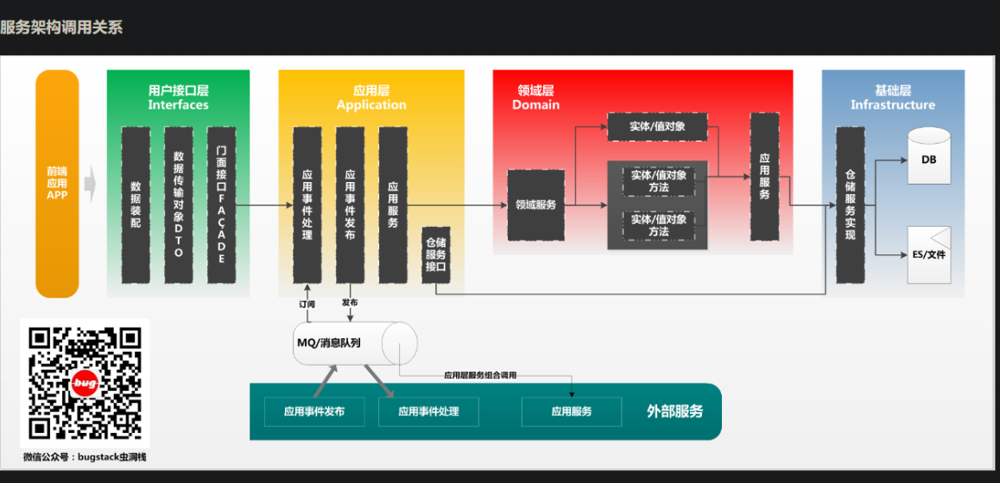

```java
主要看测试类 lottery-test 里面的今天实现
里面的 lottery-interfaces 是服务端，
它里面有时mapper扫描不到记得添加MapperScan即可。
```


## 配置广播模式 Dubbo

首先说说为什么要配置广播模式的 Dubbo，其实最早 RPC 的设计和使用都是依赖于注册中心，那就是需要把服务接口信息在程序启动的时候，推送到一个统一的注册中心，在其他需要调用 RPC 接口的服务上再通过注册中心的均衡算法来匹配可以连接的接口落到本地保存和更新。那么这样的标准的使用方式可以提供更大的连接数和更强的负载均衡作用，但目前我们这个以学习实践为目的的工程开发则需要尽可能减少学习成本，也就需要在开发阶段少一些引入一些额外的配置，那么目前使用广播模式就非常适合，以后也可以直接把 Dubbo 配置成注册中心模式。官网：[https://dubbo.apache.org](https://dubbo.apache.org/zh/docs/quick-start/)

**配置 yml**

```
# Dubbo 广播方式配置
dubbo:
  application:
    name: Lottery
    version: 1.0.0
  registry:
    address: N/A #multicast://224.5.6.7:1234
  protocol:
    name: dubbo
    port: 20880
  scan:
    base-packages: cn.itedus.lottery.rpc
```

- 广播模式的配置唯一区别在于注册地址，`registry.address = multicast://224.5.6.7:1234`，服务提供者和服务调用者都需要配置相同的📢广播地址。或者配置为 N/A 用于直连模式使用
- application，配置应用名称和版本
- protocol，配置的通信协议和端口
- scan，相当于 Spring 中自动扫描包的地址，可以把此包下的所有 rpc 接口都注册到服务中