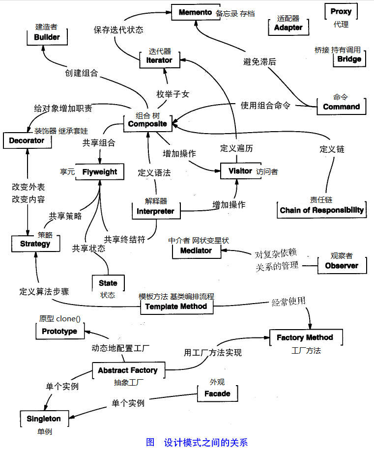
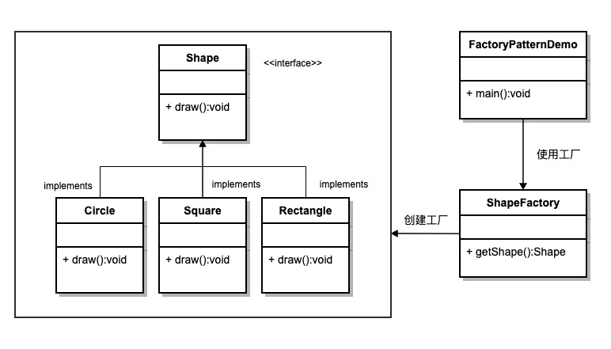
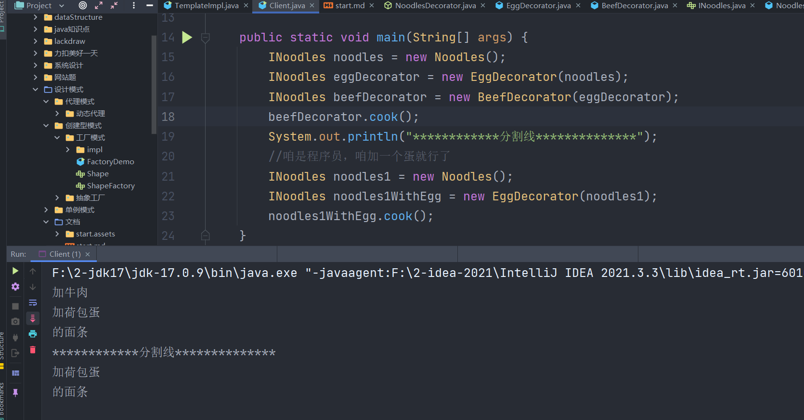

| 序号 | 模式 & 描述                                                  | 包括                                                         |      |      |      |
| :--- | :----------------------------------------------------------- | :----------------------------------------------------------- | ---- | ---- | ---- |
| 1    | **创建型模式** 这些设计模式提供了一种在创建对象的同时隐藏创建逻辑的方式，而不是使用 new 运算符直接实例化对象。这使得程序在判断针对某个给定实例需要创建哪些对象时更加灵活。 | 工厂模式（Factory Pattern）抽象工厂模式（Abstract Factory Pattern）单例模式（Singleton Pattern）建造者模式（Builder Pattern）原型模式（Prototype Pattern） |      |      |      |
| 2    | **结构型模式** 这些模式关注对象之间的组合和关系，旨在解决如何构建灵活且可复用的类和对象结构。 | 适配器模式（Adapter Pattern）桥接模式（Bridge Pattern）过滤器模式（Filter、Criteria Pattern）组合模式（Composite Pattern）装饰器模式（Decorator Pattern）外观模式（Facade Pattern）享元模式（Flyweight Pattern）代理模式（Proxy Pattern） |      |      |      |
| 3    | **行为型模式** 这些模式关注对象之间的通信和交互，旨在解决对象之间的责任分配和算法的封装。 | 责任链模式（Chain of Responsibility Pattern）命令模式（Command Pattern）解释器模式（Interpreter Pattern）迭代器模式（Iterator Pattern）中介者模式（Mediator Pattern）备忘录模式（Memento Pattern）观察者模式（Observer Pattern）状态模式（State Pattern）空对象模式（Null Object Pattern）策略模式（Strategy Pattern）模板模式（Template Pattern）访问者模式（Visitor Pattern） |      |      |      |
| 4    | **J2EE 模式** 这些设计模式特别关注表示层。这些模式是由 Sun Java Center 鉴定的。 | MVC 模式（MVC Pattern）业务代表模式（Business Delegate Pattern）组合实体模式（Composite Entity Pattern）数据访问对象模式（Data Access Object Pattern）前端控制器模式（Front Controller Pattern）拦截过滤器模式（Intercepting Filter Pattern）服务定位器模式（Service Locator Pattern）传输对象模式（Transfer Object Pattern） |      |      |      |
|      |                                                              |                                                              |      |      |      |
|      |                                                              |                                                              |      |      |      |
|      |                                                              |                                                              |      |      |      |
|      |                                                              |                                                              |      |      |      |

下面用一个图片来整体描述一下设计模式之间的关系：




## 创建型


### 工厂模式


意图：定义一个创建对象的接口，让其子类自己决定实例化哪一个工厂类，工厂模式使其创建过程延迟到子类进行。

主要解决：主要解决接口选择的问题。

何时使用：我们明确地计划不同条件下创建不同实例时。

如何解决：让其子类实现工厂接口，返回的也是一个抽象的产品。

关键代码：创建过程在其子类执行。

```java
public class ShapeFactory {
    
   //使用 getShape 方法获取形状类型的对象
   public Shape getShape(String shapeType){
      if(shapeType == null){
         return null;
      }        
      if(shapeType.equalsIgnoreCase("CIRCLE")){
         return new Circle();
      } else if(shapeType.equalsIgnoreCase("RECTANGLE")){
         return new Rectangle();
      } else if(shapeType.equalsIgnoreCase("SQUARE")){
         return new Square();
      }
      return null;
   }
}
```





## 结构型


### 装饰器模式


我们通常在编码的时候为了扩展一个类的功能往往用的是继承来实现，但是继承的缺点主要是单继承的局限性和可能产生类爆炸的后果。

装饰模式（Decorator）,动态地给一个对象添加一些额外的职责，就增加功能来说，装饰模式比生成子类更为灵活。装饰模式属于结构型模式，它是作为现有的类的一个包装。

结构模式图

解析：

Component：定义一个对象接口，可以给这些对象动态地添加职责。
ConcreteComponent：定义了一个具体的对象，也可以给这个对象添加一些职责。
Decorator：装饰抽象类，继承了 Component，从外类来扩展Component的功能，但对于Component来说，是无需知道Decorator的存在的。
ConcreteDecoratorA/B：具体的装饰对象，起到给Component添加职责的功能。
案例实现
想想一下这个情景：清晨上班的你在路上遇到一家面馆，你便进去点了一碗面吃，然后你又发现菜单栏上有许多的配料：牛肉、荷包蛋、鸡腿，这时你看到旁边的一个老板把这三个全部点了一遍加到他的面里，于是你也不甘示弱，但作为程序员的你只加了一个荷包蛋进去。
现在我们用装饰模式来完成上面这个需求：往面条里面加配料。





