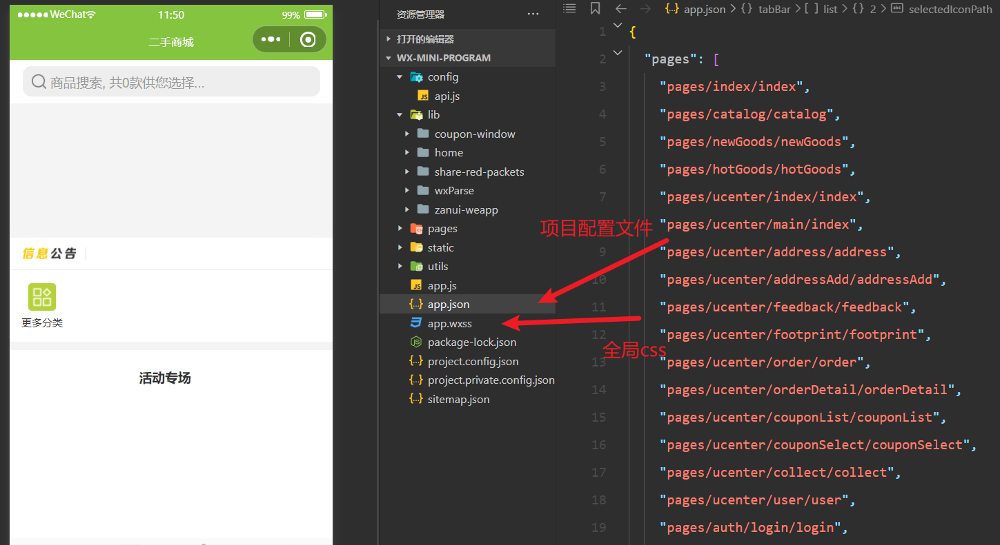

## 基础篇


### 页面基础配置


#### 总体样式

- app.json

```html
除了前面提到的必需的pages属性，app.json文件还有一个window属性，用来设置小程序的窗口。window属性的值是一个对象，其中有三个属性很常用。

navigationBarBackgroundColor：导航栏的颜色，默认为#000000（黑色）。
navigationBarTextStyle：导航栏的文字颜色，只支持black（黑色）或white（白色），默认为white。
navigationBarTitleText：导航栏的文字，默认为空。
```

- app.wxss

```apl
微信小程序允许在顶层放置一个app.wxss文件，里面采用 CSS 语法设置页面样式。这个文件的设置，对所有页面都有效。
注意，小程序虽然使用 CSS 样式，但是样式文件的后缀名一律要写成.wxss。
```





